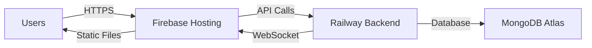

<div align="center">


# EzRent

### *Your Next Stay, Just a Click Away*

[](https://rzrent.web.app/)
[](https://reactjs.org/)
[](https://redux.js.org/)
[](https://tailwindcss.com/)
[](https://firebase.google.com/)

**Developed by Team 8-Bit Coders**  
*Project Leader: A K M Shafee Ullah*

[🚀 Live Demo](https://rzrent.web.app/) • [📖 Documentation](https://docs.google.com/document/d/1gLzOn2st3mpNy7yxs4faUXHV2BDSF6cJFKcHQ-hYyKk/edit?usp=sharing) • [👥 Team](#-our-team)

</div>

---

## 📋 Table of Contents

- [✨ Overview](#-overview)
- [🎯 Key Features](#-key-features)
- [🛠️ Technologies Used](#️-technologies-used)
- [👥 Our Team](#-our-team)
- [📸 Screenshots](#-screenshots)
- [⚙️ Installation](#️-installation--setup)
- [🚀 Deployment](#-deployment)
- [💪 Challenges & Solutions](#-challenges--solutions)
- [📁 Project Structure](#-project-structure)
- [🤝 Contributing](#-contributing)
- [📄 License](#-license)

---

## ✨ Overview

**EzRent** is a modern, full-stack rental and booking platform inspired by Airbnb, designed to revolutionize the way people discover and book properties. Built with cutting-edge web technologies, EzRent offers a seamless experience for both guests looking for their perfect stay and hosts managing their properties.

### 🌟 What Makes EzRent Special?

- 🏠 **Browse & Book** - Discover unique properties across different locations
- 💬 **Real-Time Chat** - Instant communication between guests and hosts
- 🤖 **AI Assistant** - Gemini-powered chatbot for travel queries
- 💳 **Secure Payments** - Stripe integration for safe transactions
- 📱 **Fully Responsive** - Optimized for all devices
- 🎨 **Modern UI/UX** - Beautiful, intuitive interface with smooth animations

---

## 👥 Our Team

<div align="center">

### **Team 8-Bit Coders** 💻

| Role | Name |
|------|------|
| 👑 **Project Leader** | A K M Shafee Ullah |
| 💻 **Developer** | Md Shakib Khan |
| 💻 **Developer** | Aman Munshi |

</div>

> **Our Journey:**  
> Initially, our team started with six members, but due to unavoidable circumstances, three members had to step away. Despite this challenge, the remaining three members worked with unwavering coordination, commitment, and dedication to successfully deliver this project within the timeline.

---

## 🎯 Key Features

<table>
<tr>
<td width="50%">

### 🏠 For Guests

- ✅ **Property Search & Filter**  
  Find your perfect stay with advanced filters

- 📅 **Easy Booking System**  
  Book properties in just a few clicks

- 💬 **Live Chat with Hosts**  
  Instant messaging powered by Socket.io

- 🤖 **AI Travel Assistant**  
  Get instant help from Gemini AI chatbot

- 💳 **Secure Payments**  
  Safe transactions via Stripe

- ⭐ **Reviews & Ratings**  
  Share your experience with the community

- 📱 **Wishlist & Favorites**  
  Save properties for later

</td>
<td width="50%">

### 🏢 For Hosts

- ➕ **Property Management**  
  List and manage your properties easily

- 📊 **Dashboard Analytics**  
  Track bookings and earnings

- 💬 **Guest Communication**  
  Chat with guests in real-time

- 🔔 **Booking Notifications**  
  Stay updated on new bookings

- ⚙️ **Flexible Settings**  
  Customize availability and pricing

- 📈 **Performance Insights**  
  Monitor your property performance

- 🎯 **Quick Actions**  
  Accept/reject bookings instantly

</td>
</tr>
</table>

### 🌟 Platform Highlights

| Feature | Description |
|---------|-------------|
| 🔐 **Authentication** | Secure login/signup with Firebase Authentication |
| 🎨 **Modern UI** | Beautiful interface with Tailwind CSS & Framer Motion |
| 📱 **Responsive Design** | Seamless experience across all devices |
| 🔄 **Real-time Updates** | Live notifications and chat using Socket.io |
| 🗺️ **Experience Sharing** | Community page for travelers to share stories |
| 🎯 **Smart Search** | Intelligent filtering and sorting options |
| 📊 **Redux State** | Centralized and efficient state management |

---

## 🛠️ Technologies Used

### Frontend Stack

<div align="center">


</div>

### Core Libraries

- **React.js 19** - Modern UI library
- **Redux Toolkit** - State management
- **Tailwind CSS** - Utility-first CSS framework
- **Framer Motion** - Smooth animations
- **React Router DOM** - Client-side routing
- **Axios** - HTTP client
- **Lucide Icons** - Beautiful icon library

### Integrations & Services

| Service | Purpose |
|---------|---------|
| 🔥 **Firebase** | Hosting & Authentication |
| 💳 **Stripe API** | Secure payment processing |
| 🤖 **Gemini API** | AI-powered chatbot |
| 💬 **Socket.io** | Real-time communication |
| 🗄️ **MongoDB** | Database (Backend) |
| 🚂 **Railway** | Backend hosting |

### Development Tools

```json
{
  "bundler": "Vite 7",
  "language": "JavaScript (ES6+)",
  "styling": "Tailwind CSS + Custom CSS",
  "version_control": "Git & GitHub",
  "deployment": "Firebase Hosting"
}
```

---

## 💪 Challenges & Solutions

<table>
<tr>
<th width="30%">Challenge</th>
<th width="70%">Solution</th>
</tr>
<tr>
<td>🔴 <b>Redux Complexity</b></td>
<td>✅ Modularized Redux slices with feature-based reducers for better organization and maintainability</td>
</tr>
<tr>
<td>🔴 <b>Socket.io Deployment</b></td>
<td>✅ Migrated backend from Vercel to Railway to support persistent WebSocket connections</td>
</tr>
<tr>
<td>🔴 <b>Team Reduction</b></td>
<td>✅ Remaining members adapted quickly, redistributed tasks, and maintained strong coordination to meet deadlines</td>
</tr>
<tr>
<td>🔴 <b>State Synchronization</b></td>
<td>✅ Implemented optimistic UI updates with Redux Toolkit async thunks for seamless user experience</td>
</tr>
<tr>
<td>🔴 <b>Real-time Notifications</b></td>
<td>✅ Built custom notification system with Socket.io events and Redux integration</td>
</tr>
</table>

---

## 📁 Project Structure

```
ez-rent/
├── 📂 public/
│   ├── index.html
│   └── assets/
│
├── 📂 src/
│   ├── 📂 Components/         # Reusable UI components
│   │   ├── Chat/              # Chat system components
│   │   ├── Notifications/     # Notification components
│   │   └── Shared/            # Shared components
│   │
│   ├── 📂 Pages/              # Main application pages
│   │   ├── Dashboard/         # Guest, Host, Admin dashboards
│   │   ├── PropertyDetails/   # Property detail views
│   │   └── Auth/              # Authentication pages
│   │
│   ├── 📂 redux/              # Redux state management
│   │   ├── PropertieSlice.js  # Property & booking state
│   │   ├── notificationSlice.js
│   │   └── Store.js           # Redux store
│   │
│   ├── 📂 services/           # API services
│   │   └── socketService.js   # Socket.io client
│   │
│   ├── 📂 Context/            # React Context providers
│   │   └── AuthContext.js     # Authentication context
│   │
│   ├── App.jsx                # Main app component
│   ├── main.jsx               # Entry point
│   └── index.css              # Global styles
│
├── 📄 .env                    # Environment variables
├── 📄 .gitignore
├── 📄 package.json
├── 📄 vite.config.js          # Vite configuration
└── 📄 README.md
```

---

## ⚙️ Installation & Setup

### Prerequisites

Before you begin, ensure you have the following installed:

- ✅ **Node.js** (v18 or higher) - [Download](https://nodejs.org/)
- ✅ **npm** or **yarn** - Package manager
- ✅ **Git** - Version control

### 🚀 Quick Start

1️⃣ **Clone the repository**
```bash
git clone https://github.com/your-username/ez-rent.git
cd ez-rent
```

2️⃣ **Install dependencies**
```bash
npm install
# or
yarn install
```

3️⃣ **Configure environment variables**

Create a `.env` file in the root directory:

```env
# API Configuration
VITE_API_URL=your_backend_api_url

# Firebase Configuration
VITE_FIREBASE_API_KEY=your_firebase_api_key
VITE_FIREBASE_AUTH_DOMAIN=your_auth_domain
VITE_FIREBASE_PROJECT_ID=your_project_id

# Payment Gateway
VITE_STRIPE_PUBLIC_KEY=your_stripe_public_key

# AI Chatbot
VITE_GEMINI_API_KEY=your_gemini_api_key

# Socket.io
VITE_SOCKET_URL=your_socket_server_url
```

4️⃣ **Start the development server**
```bash
npm run dev
# or
yarn dev
```

5️⃣ **Open your browser**

Navigate to `http://localhost:5173` 🎉

### 📦 Available Scripts

| Command | Description |
|---------|-------------|
| `npm run dev` | Start development server |
| `npm run build` | Build for production |
| `npm run preview` | Preview production build |
| `npm run lint` | Run ESLint |

---

## 🚀 Deployment

<div align="center">

### Deployment Architecture



</div>

| Service | Platform | Purpose |
|---------|----------|----------|
| 🌐 **Frontend** | Firebase Hosting | Fast, reliable static hosting |
| 🚂 **Backend** | Railway | Node.js server with Socket.io |
| 🗄️ **Database** | MongoDB Atlas | Cloud database |
| 💳 **Payments** | Stripe | Payment processing |

### 🔗 Live Links

- **Production:** [https://rzrent.web.app/](https://rzrent.web.app/)
- **Backend API:** Hosted on Railway
- **Status:** ✅ Active

---

## 📸 Screenshots

<div align="center">

###  Homepage


*Modern, intuitive interface with featured properties and smooth navigation*

</div>

---

## 🤝 Contributing

We welcome contributions! If you'd like to improve EzRent:

1. 🍴 Fork the repository
2. 🌿 Create a feature branch (`git checkout -b feature/amazing-feature`)
3. 💾 Commit your changes (`git commit -m 'Add amazing feature'`)
4. 📤 Push to the branch (`git push origin feature/amazing-feature`)
5. 🎯 Open a Pull Request

---

## 📄 License

This project is licensed under the MIT License - see the [LICENSE](LICENSE) file for details.

---

## 🏁 Conclusion

<div align="center">

### 💡 *From Concept to Reality*

**EzRent** represents our team's dedication, creativity, and perseverance. Despite facing early challenges and team reduction, we successfully delivered a functional, user-centric, and visually modern booking platform.

With integrated **AI assistance**, **real-time communication**, and **secure payment systems**, EzRent sets a new standard for user experience in online rental platforms.

---

### ⭐ Show Your Support

If you like this project, please consider giving it a ⭐ on GitHub!

---

### 📬 Contact Us

<table align="center">
<tr>
<td align="center">
<b>Team 8-Bit Coders</b><br>
<sub>💻 Building the future of rentals</sub>
</td>
</tr>
</table>

**Team Members:**
- 👑 A K M Shafee Ullah (Project Leader)
- 💻 Md Shakib Khan
- 💻 Aman Munshi

---

<sub>Built with ❤️ using React, Redux, and Tailwind CSS</sub>

<a href="#top">⬆️ Back to Top</a>

</div>